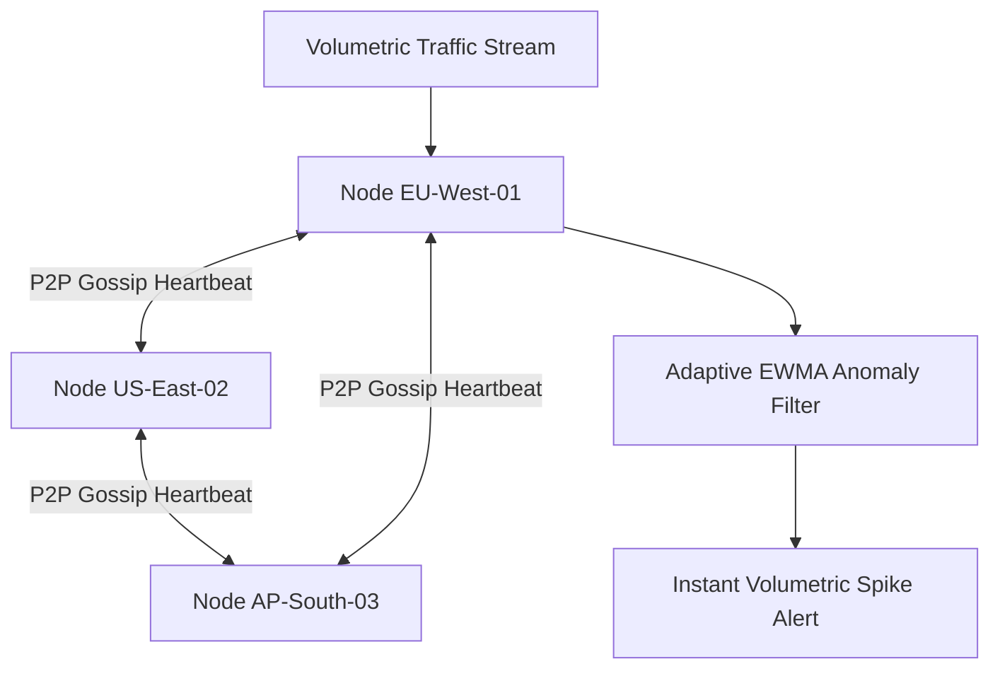

# GO-INFRASTRUCTURE-INTELLIGENCE
# Planet-Scale Infrastructure Intelligence Platform (Go)

## Executive Overview
A distributed telemetry ingestion, clustering, and anomaly detection platform written in **Go 1.21+**. It features an asynchronous **peer-to-peer gossip protocol** for cluster membership and heartbeat failure detection, coupled with an adaptive **Exponentially Weighted Moving Average (EWMA)** online time-series anomaly detector.

## Distributed Cluster Topology



### Source Tree
- **`src/cluster/gossip.go`**: Peer-to-peer gossip protocol implementation, heartbeat timers, and phi-accrual failure detection.
- **`src/anomaly/ewma.go`**: Online lock-free EWMA streaming mean, variance, and Z-score calculations.
- **`src/anomaly/ewma_test.go`**: Native Go unit tests validating baseline stability and spike detection.
- **`src/main.go`**: Standalone production server executable.
- **`go.mod`**: Go module specification.
- **`runner/run.js`**: Universal runner executing native Go or simulated fallback.

## Mathematical Formulation: Online EWMA Moments
For telemetry value x_t with smoothing factor \alpha = 0.15:
$$\mu_t = \alpha x_t + (1 - \alpha) \mu_{t-1}$$
$$\sigma_t^2 = (1 - \alpha)(\sigma_{t-1}^2 + \alpha (x_t - \mu_{t-1})^2)$$
$$Z = \frac{|x_t - \mu_t|}{\sigma_t}$$

An anomaly is flagged when Z > 3.5.

## Native Go Compilation & Testing
```bash
go test ./...
go run src/main.go
```

## Universal Verification
```bash
node runner/run.js
node orchestrator/run.js --project=22-go
```

## Senior Interview Q&A
- **Q: Why use EWMA over fixed sliding windows?** Fixed sliding windows require storing $W$ past elements in memory ($O(W)$ storage per metric). EWMA tracks running mean and variance in $O(1)$ memory and $O(1)$ time, enabling ingestion of millions of metrics per second.
- **Q: How does Go handle goroutine lifecycle during network partitions?** Context cancellation (`context.WithTimeout`) and select blocks prevent goroutine leaks when communicating with dead or partitioned peers.\n
